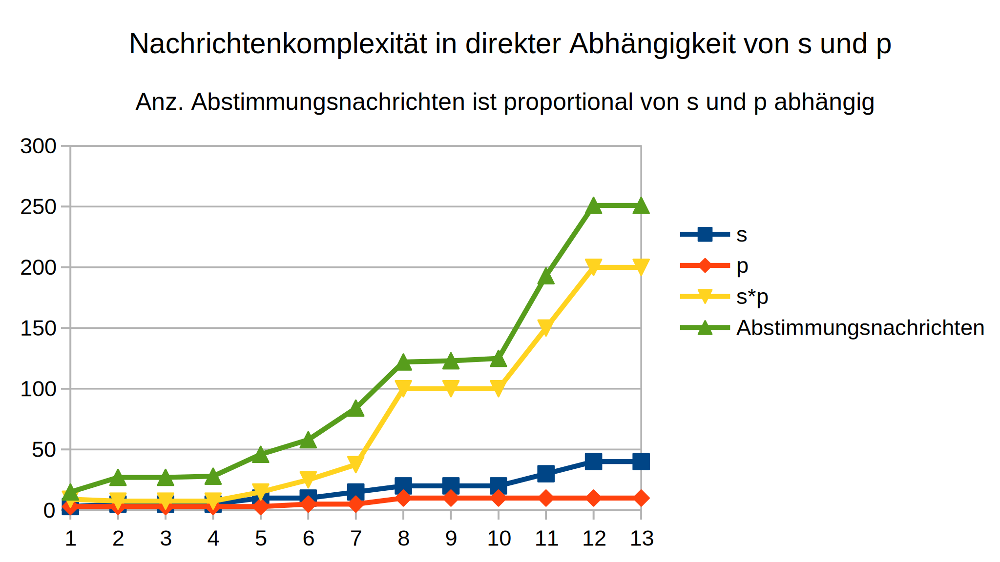
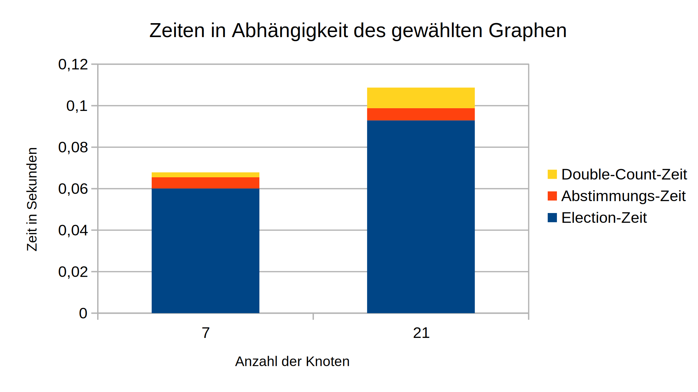
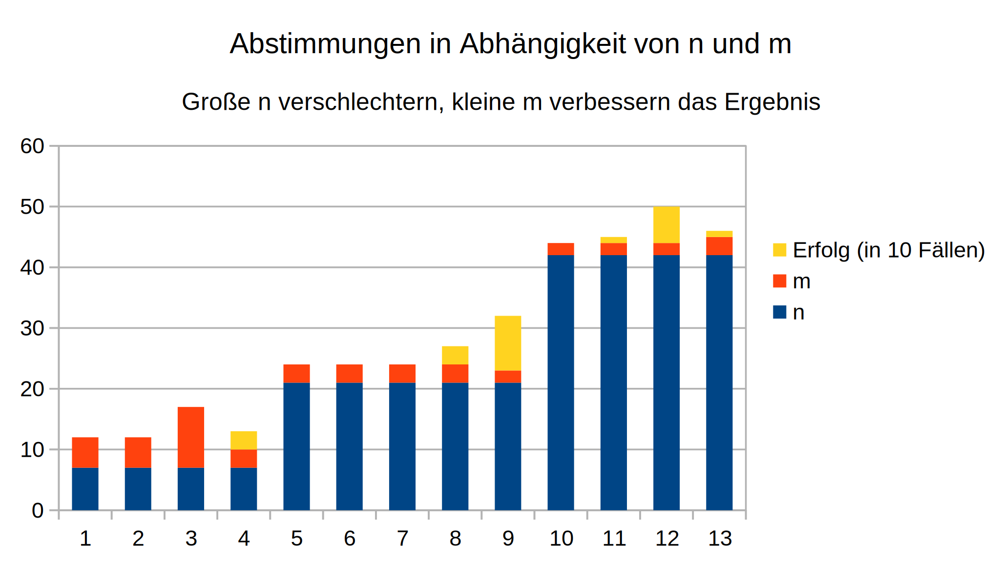

# ueb02

- Programmiersprache: Go
- Netzwerkprotokoll: TCP
- Nachrichtenformat: Protocol Buffers (protobuf)
- Programmdateien: [philosopher](./cmd/philosopher) und graphgen (siehe ueb01)

## Idee

### Election

Zur Wahl des Koordinators wird die *Echo-based Election* aus Kapitel 4 verwendet. Die Wahl startet dabei nicht von automatisch sondern per Kontrollnachricht. Die zufälligen Startknoten wählt ein Bash-Skript ([election.sh](./scripts/election.sh)).

Bei der Wahl kommt *Debouncing* zum Einsatz, bei dem ein Knoten seinen Wahlsieg nicht sofort, sondern erst nach einer weiteren Sekunde bestätigt. Sollte der Knoten in der Zwischenzeit von einem anderen Knoten abgelöst worden sein, so kann es mithilfe dieses Mechanismus nicht zu mehreren gewählten Koordinatoren kommen. Die Wartezeit beträgt eine ganze Sekunde.

Vorteil dieser Wahlmethode ist, dass automatisch ein Spannbaum aufgespannt wird, der später zum Einsammeln und Propagieren des Ergebnisses genutzt werden kann. Der gewählte Koordinator erhält jedoch alle anderen Knoten als Nachbarn, sodass er auf direktem Wege kommunizieren kann.

### Abstimmungen

Nach der Election versendet der gewählte Koordinator an zufällige Startknoten entsprechende Kontrollnachrichten. Dabei ist anders als in der Übung gewollt die Anzahl der Nachbarn die obere Schranke für die Anzahl der Abstimmungen eines Knotens. Auch fahren von Startknoten kontaktierte Philosophen die Wahl nicht weiter (leider gab es hier Missverständnisse und dementsprechend Punktabzug).

Die Funktionsweise ist analog zur ersten Übung, nur das die Anwendungsnachrichten eine Zahl und keinen String als Payload haben und entsprechend etwas mehr Logik dazu gekommen ist, etwa um auf Anwendungsnachrichten zu antworten.

### Einsammeln der Ergebnisse

Wie in der Übung gefordert erfolgt das Einsammeln der Ergebnisse per *Double-Counting* Methode. Nachdem der Koordinator die letzte Startnachricht versendet hat, widmet dieser sich dem Einsammeln der Ergebnisse. Das Einsammeln erfolgt jede Sekunde (also insgesamt mindestens zwei Sekunden). Der Koordinator erhält dabei einen neuen Nachrichten-Typ, nämlich Statusnachrichten.

Statusnachrichten enthalten den aktuellen Status eines Knotens (aktiv/passiv) sowie die Anzahl seiner gesendeten/erhaltenen Nachrichten und natürlich auch den aktuelle Stand nach aktuellem Stand. Propagiert werden Statusnachrichten entlang des Spannbaums, sodass Knoten, die kein Koordinator sind, Statusnachrichten weiterleiten, bis diese letztendlich beim Koordinator ankommen.

Der Koordinator sammelt die Statusnachrichten ein und wertet sie gemäß der aus der Vorlesung bekannten Methode aus. Daraus entsteht das Ergebnis, falls das Double Counting erfolgreich war. Ansonsten wird von vorne gezählt.

## Nachrichtenformat

Analog zu ueb01. Neben Anwendungsnachrichten und Kontrollnachrichten gibt es einen neuen Nachrichten-Typ für die Election sowie einen neuen Nachrichten-Typ für die Double-Counting Methode (Statusnachrichten).

## Softwarestruktur

Analog zu ueb01. Die `directory` und `handler` Module wurden entsprechend der neuen Nachrichten angepasst. Vielerorts gab es Refactorings und ungenutzte Funktionalität wurde entfernt. Neu ist, dass Util-Funktionen sich nun in einem übergeordneten `util` Modul befinden. Das vereinfacht den Dateibaum immens. Ansonsten ist die herkömmliche TCP-Server Struktur zum Großteil erhalten geblieben.

## Stärken & Schwächen

### Performance und Nebenläufigkeit

Dieser Punkt macht sich auch in der zweiten Übung deutlich, vor allem beim Double-Counting. Hier ist es nämlich beim Anfertigen der Messungen für die zweite Aufgabe nicht einmal zu einer Neuzählung gekommen. Das liegt daran, dass die Abstimmungen in Sekundenbruchteilen stattfinden, da sie relativ einfach sind und jeweils nur zwischen zwei Nachbarn stattfinden. Da der erste Count erst nach einer Sekunde passiert, sind die Abstimmungen bis dahin immer abgeschlossen.

### Resilienz

Ein Nachteil ist die Resilienz der Anwendung. Würde etwa beim Double Counting ein Knoten ausfallen, so würde das Double Counting nicht mehr funktionieren, da mit einer festen Anzahl an Antworten gerechnet wird. Das würde wahrscheinlich auch noch andere Codestellen betreffen.

## Beispiele

```sh
$ ./scripts/a1.sh 5
[philo-002] 20:06:51.104763 Listening on port :5001
[philo-003] 20:06:51.104763 Listening on port :5002
[philo-001] 20:06:51.104763 Listening on port :5000
[philo-002] 20:06:51.104763 Neighbors: 1, 3, 4
[philo-003] 20:06:51.104763 Neighbors: 2, 4, 5
[philo-001] 20:06:51.104763 Neighbors: 2, 5
[philo-002] 20:06:51.105762 Preferred t = 3
[philo-003] 20:06:51.105762 Preferred t = 3
[philo-001] 20:06:51.105762 Preferred t = 3
[philo-004] 20:06:51.106762 Listening on port :5003
[philo-004] 20:06:51.106762 Neighbors: 2, 3
[philo-004] 20:06:51.106762 Preferred t = 7
[philo-005] 20:06:51.106762 Listening on port :5004
[philo-005] 20:06:51.106762 Neighbors: 1, 3
[philo-005] 20:06:51.106762 Preferred t = 9
[philo-003] 20:06:52.718776 Received control message: START_ELECTION
[philo-003] 20:06:52.721776 Sent explorer to node 2
[philo-002] 20:06:52.721776 Received explorer message with ID 3 from 3
[philo-003] 20:06:52.722776 Sent explorer to node 4
[philo-004] 20:06:52.722776 Received explorer message with ID 3 from 3
[philo-003] 20:06:52.722776 Sent explorer to node 5
[philo-005] 20:06:52.722776 Received explorer message with ID 3 from 3
[philo-002] 20:06:52.725776 Sent explorer to node 1
[philo-001] 20:06:52.725776 Received explorer message with ID 3 from 2
[philo-004] 20:06:52.725776 Sent explorer to node 2
[philo-002] 20:06:52.725776 Received explorer message with ID 3 from 4
[philo-004] 20:06:52.725776 Received explorer message with ID 3 from 2
[philo-002] 20:06:52.725776 Sent explorer to node 4
[philo-005] 20:06:52.725776 Sent explorer to node 1
[philo-001] 20:06:52.725776 Received explorer message with ID 3 from 5
[philo-004] 20:06:52.726777 Sent echo to node 3
[philo-003] 20:06:52.726777 Received echo message with ID 3 from 4
[philo-001] 20:06:52.728778 Sent explorer to node 5
[philo-005] 20:06:52.728778 Received explorer message with ID 3 from 1
[philo-001] 20:06:52.728778 Sent echo to node 2
[philo-002] 20:06:52.728778 Received echo message with ID 3 from 1
[philo-005] 20:06:52.728778 Sent echo to node 3
[philo-003] 20:06:52.728778 Received echo message with ID 3 from 5
[philo-003] 20:06:52.729776 Received echo message with ID 3 from 2
[philo-002] 20:06:52.729776 Sent echo to node 3
[philo-003] 20:06:52.729776 INITIATOR IS GREEN
[philo-002] 20:06:52.754775 Received control message: START_ELECTION
[philo-002] 20:06:52.754775 Skipping own election in favor of 3
[philo-001] 20:06:52.787776 Received control message: START_ELECTION
[philo-001] 20:06:52.787776 Skipping own election in favor of 3
[philo-004] 20:06:52.823272 Received control message: START_ELECTION
[philo-004] 20:06:52.823272 Sent explorer to node 2
[philo-002] 20:06:52.823272 Received explorer message with ID 4 from 4
[philo-002] 20:06:52.823272 Discarding election of 3 in favor of 4
[philo-003] 20:06:52.824272 Received explorer message with ID 4 from 4
[philo-004] 20:06:52.824272 Sent explorer to node 3
[philo-003] 20:06:52.824272 Discarding election of 3 in favor of 4
[philo-002] 20:06:52.824272 Sent explorer to node 1
[philo-001] 20:06:52.824272 Received explorer message with ID 4 from 2
[philo-001] 20:06:52.824272 Discarding election of 3 in favor of 4
[philo-002] 20:06:52.824272 Sent explorer to node 3
[philo-003] 20:06:52.824272 Sent explorer to node 2
[philo-002] 20:06:52.824272 Received explorer message with ID 4 from 3
[philo-001] 20:06:52.824272 Sent explorer to node 5
[philo-005] 20:06:52.824272 Received explorer message with ID 4 from 1
[philo-003] 20:06:52.824272 Received explorer message with ID 4 from 2
[philo-005] 20:06:52.825272 Discarding election of 3 in favor of 4
[philo-003] 20:06:52.825272 Sent explorer to node 5
[philo-005] 20:06:52.825272 Received explorer message with ID 4 from 3
[philo-003] 20:06:52.825272 Received explorer message with ID 4 from 5
[philo-005] 20:06:52.825272 Sent explorer to node 3
[philo-003] 20:06:52.825272 Sent echo to node 4
[philo-005] 20:06:52.825272 Sent echo to node 1
[philo-004] 20:06:52.825272 Received echo message with ID 4 from 3
[philo-001] 20:06:52.825272 Received echo message with ID 4 from 5
[philo-002] 20:06:52.826272 Received echo message with ID 4 from 1
[philo-001] 20:06:52.826272 Sent echo to node 2
[philo-002] 20:06:52.827272 Sent echo to node 4
[philo-004] 20:06:52.827272 Received echo message with ID 4 from 2
[philo-004] 20:06:52.827272 INITIATOR IS GREEN
[philo-005] 20:06:52.856271 Received control message: START_ELECTION
[philo-005] 20:06:52.857271 Sent explorer to node 1
[philo-001] 20:06:52.857271 Received explorer message with ID 5 from 5
[philo-001] 20:06:52.857271 Discarding election of 4 in favor of 5
[philo-005] 20:06:52.858271 Sent explorer to node 3
[philo-003] 20:06:52.858271 Received explorer message with ID 5 from 5
[philo-001] 20:06:52.858271 Sent explorer to node 2
[philo-002] 20:06:52.858271 Received explorer message with ID 5 from 1
[philo-003] 20:06:52.858271 Discarding election of 4 in favor of 5
[philo-002] 20:06:52.858271 Discarding election of 4 in favor of 5
[philo-002] 20:06:52.858271 Received explorer message with ID 5 from 3
[philo-003] 20:06:52.859272 Sent explorer to node 2
[philo-002] 20:06:52.859272 Sent explorer to node 3
[philo-003] 20:06:52.859272 Received explorer message with ID 5 from 2
[philo-003] 20:06:52.859272 Sent explorer to node 4
[philo-004] 20:06:52.859272 Received explorer message with ID 5 from 3
[philo-002] 20:06:52.859272 Sent explorer to node 4
[philo-004] 20:06:52.859272 Discarding election of 4 in favor of 5
[philo-004] 20:06:52.859272 Received explorer message with ID 5 from 2
[philo-002] 20:06:52.860272 Received explorer message with ID 5 from 4
[philo-004] 20:06:52.860272 Sent explorer to node 2
[philo-002] 20:06:52.860272 Sent echo to node 1
[philo-001] 20:06:52.860272 Received echo message with ID 5 from 2
[philo-004] 20:06:52.860272 Sent echo to node 3
[philo-003] 20:06:52.860272 Received echo message with ID 5 from 4
[philo-001] 20:06:52.861271 Sent echo to node 5
[philo-005] 20:06:52.861271 Received echo message with ID 5 from 1
[philo-003] 20:06:52.861271 Sent echo to node 5
[philo-005] 20:06:52.861271 Received echo message with ID 5 from 3
[philo-005] 20:06:52.861271 INITIATOR IS GREEN
[philo-005] 20:06:53.861626 ------- ELECTION VICTORY -------
[philo-004] 20:06:53.861626 Received control message: START
[philo-005] 20:06:53.861626 Sent START command to node 4
[philo-003] 20:06:53.862627 Received control message: START
[philo-005] 20:06:53.862627 Sent START command to node 3
[philo-004] 20:06:53.862627 Sent application message to node 2: t = 7
[philo-002] 20:06:53.862627 Received application message from 4
[philo-002] 20:06:53.862627 Neighbor t = 7, Old t = 3, New t = 5
[philo-004] 20:06:53.862627 Received application message from 3
[philo-003] 20:06:53.862627 Sent application message to node 4: t = 3
[philo-004] 20:06:53.862627 Neighbor t = 3, Old t = 7, New t = 5
[philo-003] 20:06:53.862627 Received application message from 4
[philo-002] 20:06:53.863627 Acknowledged application message of node 4
[philo-004] 20:06:53.862627 Sent application message to node 3: t = 7
[philo-003] 20:06:53.863627 Neighbor t = 7, Old t = 3, New t = 5
[philo-002] 20:06:53.863627 Received application message from 3
[philo-004] 20:06:53.863627 Acknowledged application message of node 3
[philo-003] 20:06:53.863627 Sent application message to node 2: t = 3
[philo-002] 20:06:53.863627 Neighbor t = 3, Old t = 5, New t = 4
[philo-004] 20:06:53.863627 Received application message from 2
[philo-003] 20:06:53.863627 Received application message from 4
[philo-004] 20:06:53.863627 Neighbor t = 5, Old t = 5, New t = 5
[philo-003] 20:06:53.864627 Neighbor t = 5, Old t = 5, New t = 5
[philo-004] 20:06:53.863627 Received application message from 3
[philo-002] 20:06:53.864627 Acknowledged application message of node 3
[philo-003] 20:06:53.863627 Acknowledged application message of node 4
[philo-004] 20:06:53.864627 Neighbor t = 5, Old t = 5, New t = 5
[philo-003] 20:06:53.864627 Received application message from 2
[philo-003] 20:06:53.864627 Neighbor t = 4, Old t = 5, New t = 5
[philo-005] 20:06:54.871450 ------- COUNTING RESULTS -------
[philo-005] 20:06:54.871450 Sent GET_STATUS command to node 1
[philo-001] 20:06:54.871450 Received control message: GET_STATUS
[philo-005] 20:06:54.872455 Sent GET_STATUS command to node 2
[philo-002] 20:06:54.872455 Received control message: GET_STATUS
[philo-001] 20:06:54.872455 Sent status message to node 5
[philo-005] 20:06:54.872455 Coordinator got status from 1
[philo-005] 20:06:54.872455 Sent GET_STATUS command to node 3
[philo-003] 20:06:54.872455 Received control message: GET_STATUS
[philo-002] 20:06:54.872455 Sent status message to node 1
[philo-001] 20:06:54.873451 Forwarded status message from node 2 to node 5
[philo-005] 20:06:54.873451 Coordinator got status from 2
[philo-004] 20:06:54.873451 Received control message: GET_STATUS
[philo-003] 20:06:54.873451 Sent status message to node 5
[philo-005] 20:06:54.873451 Sent GET_STATUS command to node 4
[philo-005] 20:06:54.873451 Coordinator got status from 3
[philo-004] 20:06:54.873451 Sent status message to node 3
[philo-003] 20:06:54.874450 Forwarded status message from node 4 to node 5
[philo-005] 20:06:54.874450 Coordinator got status from 4
[philo-005] 20:06:55.862694 ------- COUNTING RESULTS -------
[philo-005] 20:06:55.862694 Sent GET_STATUS command to node 1
[philo-001] 20:06:55.862694 Received control message: GET_STATUS
[philo-002] 20:06:55.863700 Received control message: GET_STATUS
[philo-005] 20:06:55.863700 Sent GET_STATUS command to node 2
[philo-001] 20:06:55.863700 Sent status message to node 5
[philo-005] 20:06:55.863700 Coordinator got status from 1
[philo-002] 20:06:55.863700 Sent status message to node 1
[philo-005] 20:06:55.863700 Sent GET_STATUS command to node 3
[philo-003] 20:06:55.863700 Received control message: GET_STATUS
[philo-001] 20:06:55.863700 Forwarded status message from node 2 to node 5
[philo-005] 20:06:55.863700 Coordinator got status from 2
[philo-004] 20:06:55.864695 Received control message: GET_STATUS
[philo-005] 20:06:55.864695 Sent GET_STATUS command to node 4
[philo-003] 20:06:55.864695 Sent status message to node 5
[philo-005] 20:06:55.864695 Coordinator got status from 3
[philo-004] 20:06:55.864695 Sent status message to node 3
[philo-003] 20:06:55.864695 Forwarded status message from node 4 to node 5
[philo-005] 20:06:55.864695 Coordinator got status from 4
[philo-005] 20:06:55.865695 ------- DOUBLE COUNT DONE -------
[philo-005] 20:06:55.865695 No philosopher is active
[philo-005] 20:06:55.865695 Sum of sent messages: 16
[philo-005] 20:06:55.865695 Sum of received messages: 16
[philo-005] 20:06:55.865695 Double count is valid!
[philo-005] 20:06:55.865695 1 prefers 3
[philo-005] 20:06:55.865695 2 prefers 4
[philo-005] 20:06:55.865695 3 prefers 5
[philo-005] 20:06:55.865695 4 prefers 5
[philo-005] 20:06:55.865695 5 prefers 9
[philo-005] 20:06:55.865695 The voted times do not match
[philo-005] 20:06:55.873833 Propagated vote result to 1
[philo-001] 20:06:55.873833 Received application message from 5
[philo-001] 20:06:55.873833 The vote result is indecision
[philo-002] 20:06:55.873833 Received application message from 5
[philo-005] 20:06:55.873833 Propagated vote result to 2
[philo-002] 20:06:55.873833 The vote result is indecision
[philo-005] 20:06:55.874835 Propagated vote result to 3
[philo-003] 20:06:55.874835 Received application message from 5
[philo-003] 20:06:55.874835 The vote result is indecision
[philo-005] 20:06:55.874835 Propagated vote result to 4
[philo-004] 20:06:55.874835 Received application message from 5
[philo-004] 20:06:55.874835 The vote result is indecision

# In einem zweiten Terminal, verursacht die erste Nachricht um 20:06:52
$ ./scripts/election.sh ./configs/config.csv
5002
5001
5000
5003
5004
```

## Fazit

Die Ergebnisse der Messungen für die zweite Aufgabe sind im [docs](./docs) Ordner als Tabellendokument zu finden. Ein Auszug der Diagramme:






